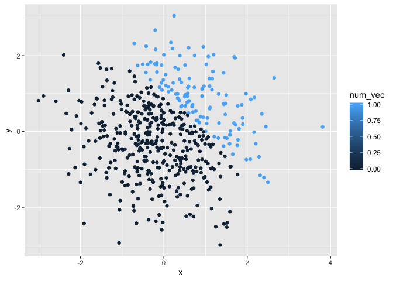
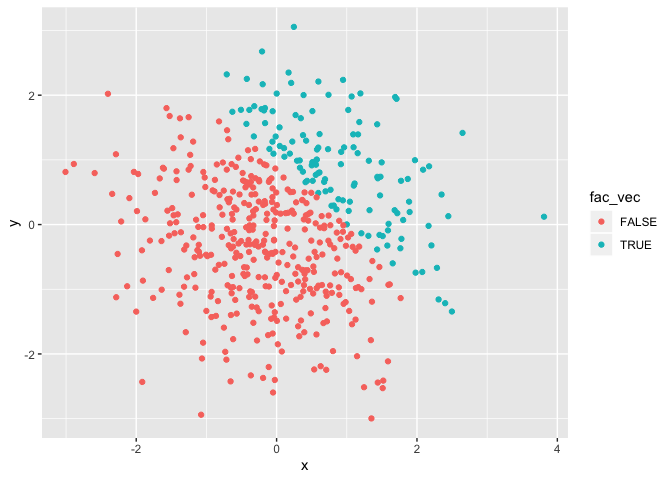

p8105\_hw1\_sl4657
================
Si Li

# Problem 1

## create a data frame

``` r
library(tidyverse)
```

    ## ── Attaching packages ───────────────────────────────────────── tidyverse 1.2.1 ──

    ## ✔ ggplot2 3.2.1     ✔ purrr   0.3.2
    ## ✔ tibble  2.1.3     ✔ dplyr   0.8.3
    ## ✔ tidyr   0.8.3     ✔ stringr 1.4.0
    ## ✔ readr   1.3.1     ✔ forcats 0.4.0

    ## ── Conflicts ──────────────────────────────────────────── tidyverse_conflicts() ──
    ## ✖ dplyr::filter() masks stats::filter()
    ## ✖ dplyr::lag()    masks stats::lag()

``` r
lo_df = tibble(
  sample = rnorm(8),
  vec_logical = sample > 0,
  vec_char = c("A", "B", "C", "D", "E", "F", "G", "H"),
  vec_factor = factor(c("white", "red", "black", "red", "white", "red", "black", "white"))
)
lo_df
```

    ## # A tibble: 8 x 4
    ##   sample vec_logical vec_char vec_factor
    ##    <dbl> <lgl>       <chr>    <fct>     
    ## 1 -1.42  FALSE       A        white     
    ## 2 -1.39  FALSE       B        red       
    ## 3  0.530 TRUE        C        black     
    ## 4 -0.568 FALSE       D        red       
    ## 5 -2.27  FALSE       E        white     
    ## 6  0.961 TRUE        F        red       
    ## 7 -0.869 FALSE       G        black     
    ## 8 -0.334 FALSE       H        white

``` r
mean(pull(lo_df, sample))
```

    ## [1] -0.6691174

``` r
mean(pull(lo_df, vec_logical))
```

    ## [1] 0.25

``` r
mean(pull(lo_df, vec_char))
```

    ## Warning in mean.default(pull(lo_df, vec_char)): argument is not numeric or
    ## logical: returning NA

    ## [1] NA

``` r
mean(pull(lo_df, vec_factor))
```

    ## Warning in mean.default(pull(lo_df, vec_factor)): argument is not numeric
    ## or logical: returning NA

    ## [1] NA

``` r
num_resl <- as.numeric(pull(lo_df, vec_logical))
prod(num_resl)
fac_resl <- as.factor(pull(lo_df, vec_logical))
prod(fac_resl)
fac_resl <- as.factor(pull(lo_df, vec_logical))
num_resl2 <- as.numeric(fac_resl)
prod(num_resl2)
## seems like only numeric vector can do arithmetic operation
```

# Problem 2

## create a data frame

``` r
set.seed(1)
plot_df = tibble(
  x = rnorm(500),
  y = rnorm(500),
  vec_log = x + y > 1
)
num_vec <- as.numeric(pull(plot_df, vec_log))
fac_vec <- as.factor(pull(plot_df, vec_log))
plot_df
```

    ## # A tibble: 500 x 3
    ##         x       y vec_log
    ##     <dbl>   <dbl> <lgl>  
    ##  1 -0.626  0.0773 FALSE  
    ##  2  0.184 -0.297  FALSE  
    ##  3 -0.836 -1.18   FALSE  
    ##  4  1.60   0.0113 TRUE   
    ##  5  0.330  0.992  TRUE   
    ##  6 -0.820  1.59   FALSE  
    ##  7  0.487 -1.37   FALSE  
    ##  8  0.738 -0.250  FALSE  
    ##  9  0.576  1.16   TRUE   
    ## 10 -0.305 -1.11   FALSE  
    ## # … with 490 more rows

The data frame have 500 rows and 3 columns, the mean of `x` is
0.0226441, the median of `x` is -0.0367783, the standard deviation of
`x` is 1.0119283, the proportion of `x + y > 1` is 0.252.

## make a scatterplot

``` r
plot_df %>% 
  ggplot(aes(x = x, y = y, color = vec_log)) + geom_point()
```

<!-- -->

``` r
ggsave("scatter_plot_log.pdf")
```

    ## Saving 7 x 5 in image

``` r
plot_df %>% 
ggplot(aes(x = x, y = y, color = num_vec)) + geom_point()
```

<!-- -->

``` r
plot_df %>% 
ggplot(aes(x = x, y = y, color = fac_vec)) + geom_point()
```

<!-- -->
